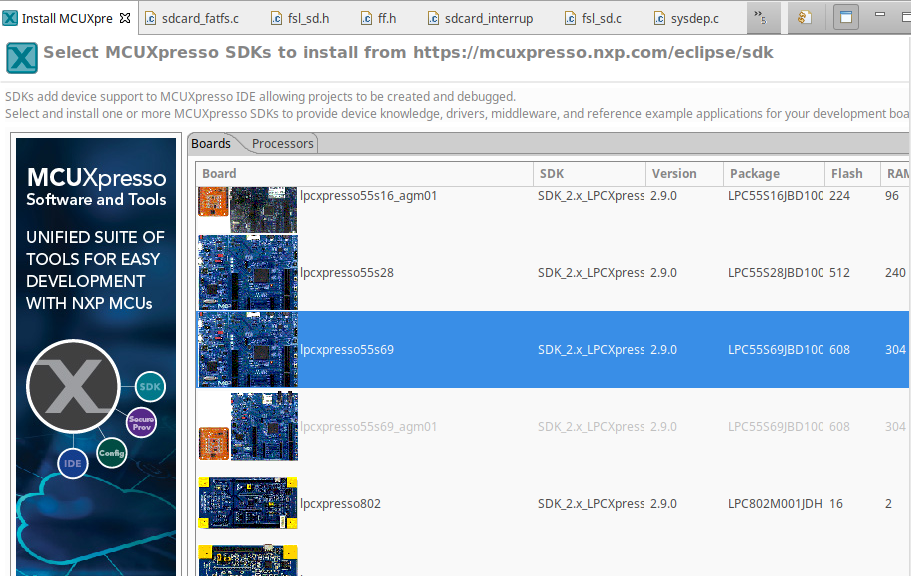
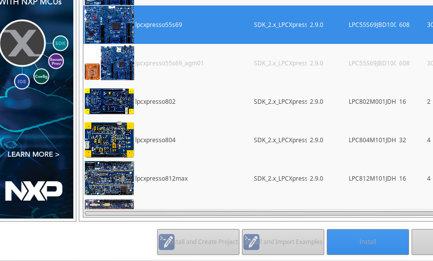
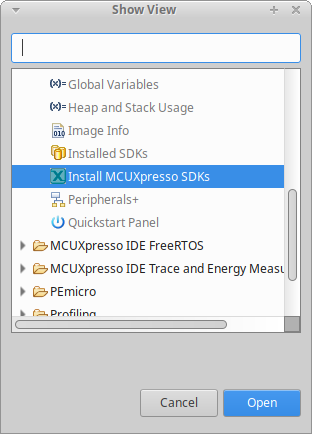

# Projet CM33

## Introduction

On a commencé le portage d'un mini matlab (qui fonctionne à la base sur PC) sur un microcontrôleur NXP LPC55S69. Malheureusement, il n'est pas terminé. On vous propose de nous aider à avancer dans le développement.

C'est l'occasion de découvrir le microcontrôleur [LPC55S69](https://www.nxp.com/products/processors-and-microcontrollers/arm-microcontrollers/general-purpose-mcus/lpc5500-cortex-m33/high-efficiency-arm-cortex-m33-based-microcontroller-family:LPC55S6x) de NXP, mais aussi l'accès à une carte SD et de voir comment on accède aux fichiers, de commander un écran LCD, de démarrer le deuxième cœur du microcontrôleur, et d'utiliser le DSP intégré.

Le microcontrôleur comporte deux processeurs [Cortex-M33](doc/ARM/Arm-Cortex-M33-Processor-Datasheet.pdf) qui exécutent le jeu d'instruction armv8-m, ainsi que de nombreux coupleurs périphériques.

Avant de se lancer dans le développement, il est nécessaire d'installer la chaîne de développement edt SDK.


## Installation de l'IDE MCUXpresso et du SDK

L'IDE (Integrated Development Envronment) MCUXpresso doit être installé sur votre machine personnelle. Il est disponible à l'URL

https://www.nxp.com/design/software/development-software/mcuxpresso-software-and-tools-/mcuxpresso-integrated-development-environment-ide:MCUXpresso-IDE

Installez la dernière version -- celle qui est proposée au téléchargement. Vous devez vous créer un compte chez NXP.

Le logiciel existe pour les systèmes Windows / MacOS (x86 et arm64) / Linux et s'exécute de la même manière dans les trois environnements. Il faut prévoir qq Go sur le disque. Les espaces dans les noms de répertoires posent des problèmes. Sous Windows, installer éventuellement à la racine du disque. Sous Linux, il installe par défaut dans `/usr/local/` .

Quand on lance la première fois MCUXpresso, on a une vue qui permet tout de suite d'installer le SDK pour le microcontrôleur LPC55S69. Vous pouvez naviguer dans la vue et choisir la carte "lpcxpresso55S69",



puis il faut aller tout en bas de la vue et cliquer sur le **bouton INSTALL**.



Si vous avez fermé la vue, vous pouvez la rechercher via le menu : Window > Show view > Install MCUXpresso SDKs   dans MCUXpresso.



*Résolution des problèmes*

* Windows

	L'utilisation correcte nécessite que le chemin d'accès au workspace de MCUXpresso ne contienne pas d'espace, de caractères accentué ... Si dans votre login Windows, il y a des espaces, caractères accentués, ... placez le workspace (vous pouvez le modifier avec le menu File > Switch Workspace) dans le répertoire Public de Windows

* Linux : l'installateur n'est compatible qu'avec des distributions debian/Ubuntu-like.

	Il reste un problème de dépendance à python3.8, et potentiellement à ncurses5 qui se manifeste au moment du debug, mais qu'on peut régler de la manière suivante

	```
	# installer une version de ncurses5
	wget http://archive.ubuntu.com/ubuntu/pool/universe/n/ncurses/libtinfo5_6.4-2_amd64.deb && sudo dpkg -i libtinfo5_6.4-2_amd64.deb && rm -f libtinfo5_6.4-2_amd64.deb
	wget http://archive.ubuntu.com/ubuntu/pool/universe/n/ncurses/libncurses5_6.4-2_amd64.deb && sudo dpkg -i libncurses5_6.4-2_amd64.deb && rm -f libncurses5_6.4-2_amd64.deb
	wget http://archive.ubuntu.com/ubuntu/pool/universe/n/ncurses/libncursesw5_6.4-2_amd64.deb && sudo dpkg -i libncursesw5_6.4-2_amd64.deb && rm -f libncursesw5_6.4-2_amd64.deb
	
	# install du snap python38
	sudo snap install python38
	```
	
	Il faut ensuite modifier le fichier `~/.local/share/applications/com.nxp/mcuxpressoide.desktop` pour permettre à mcuxpresso de trouver l'installation python alternative.
	
	```
	# modifier la ligne
	Exec=env PYTHONHOME=/snap/python38/current/usr SWT_GTK3=0 /usr/local/mcuxpressoide-11.10.0_3148/ide/mcuxpressoide
	```
	
	L'application devrait être accessible à patir du menu des applications.
	
	*Pour les autres distributions*, l'installation passe par la copie des fichiers installés dans le /usr/local d'une distribution debian/ubuntu, puis de régler les éventuelles dépendances qui ne seraient pas satisfaites.
	
	Les points de blocage principaux seront probablement autour de python 3.8 et ncurses
	
	Sur des distributions dérivant de type *archlinux*, les paquets ncurses5-compat-libs et python38 sont disponibles à partir du *archlinux linux repository* (AUR)

	```
	## Installation de ncurses5-compat-libs
	# installer un compilateur
	pacman -S --need base-devel
	# récupérer le PKGBULD
	git clone https://aur.archlinux.org/ncurses5-compat-libs.git
	
	# compiler le paquet
	makepkg --skippgpcheck --syncdeps
	
	# installer le paquet
	pacman -U ncurses5-compat-libs6.5-1-x86_68.pkg.tar.zst
	```

	python38 est disponible https://aur.archlinux.org/packages/python38](https://aur.archlinux.org/packages/python38)

## Projet

Le projet comporte 12UC. Les éléments pour démarrer sont fournis dans le répertoire git

* [Projet calc cm33](lpc55s69_calc.pdf)
* projet MCUXpresso : [lpc55s69_calc_starter.zip](calc/lpc55s69_calc_starter.zip)
* [documentation de la calculatrice](calc.md) et description de l'[API](insider.md) utilisée par les fonctions 
* [contenu](calc/sdcard.zip) à copier sur la carte sd formatée en FAT32

Codes ressource :

* code main core 1 (multicore slave)
* projet accéléromètre : [sen_cm33lab3_i2c.zip](calc/sen_cm33lab3_i2c.zip)

## Ressources

Schéma et manuel de la carte, datasheet, ... : ils sont fournis dans le répertoire git.

* du schéma (LPC55S69-EVK\_SCH\_revA2.pdf) de la carte LPC55S69-EVK de NXP et de son manuel (UM11158.pdf),
* de la datasheet (LPC55S6x.pdf) et du User Manual (UM11126.pdf) du microcontrôleur LPC55S69,
* du manuel de référence du SDK (MCUXpresso SDK API Reference Manuals\_LPC55S69.pdf).

Etapes du portage déjà réalisé : [portage.md](portage.md)

Quelques labos au besoin

* LAB1 : [GPIO et IRQ](lab1.md)
* LAB2 : [Timer](lab2.md)
* LAB3 : [Liaisons série](lab3.md)

Autre ressources

* PowerQuad Blog

	[LPC55S69 + PowerQuad Part 1 : A Great Solution for the Industrial IOT and Smart Metering](https://community.nxp.com/t5/Blog/LPC55S69-PowerQuad-Part-1-A-Great-Solution-for-the-Industrial/ba-p/1131115)
	
	[LPC55S69 + PowerQuad Part 2 : Digital IIR Filtering](https://community.nxp.com/t5/Blog/LPC55S69-PowerQuad-Part-2-Digital-IIR-Filtering/ba-p/1131184)
	
	[LPC55S69 + PowerQuad Part 3 : Fast Fourier Transforms](https://community.nxp.com/t5/Blog/LPC55S69-PowerQuad-Part-3-Fast-Fourier-Transforms-Rulers-Gauges/ba-p/1131201)

	[LPC55S69 + PowerQuad Part 4 : Matrix and Vector Processing](https://community.nxp.com/t5/Blog/LPC55S69-PowerQuad-Part-4-Matrix-and-Vector-Processing/ba-p/1131130)

* [blog mcuoneclipse.com](https://mcuoneclipse.com)
* [blog vidéo de Mark DUNNETT](https://www.youtube.com/watch?v=w_2wp_wXYMg&list=UUGb0cwww_CENTI1wgo6FJTw&index=28)
* [SDK API](https://mcuxpresso.nxp.com/api_doc/dev/1571/)
* [training videos de NXP](https://www.nxp.com/design/training:TRAINING-EVENTS?&tid=sbmenu#/collection=trainings&start=0&max=25&parameters=TrainingType.Topics.deviceTax.applicationTax.country&query=training_date%3E%3E2020-07-08..*::deviceTax%3E%3Ec731_c1770_c173_c1605&language=en&fields=ExternalFlag.Sub_Asset_Type.Asset_Type.type.url_s.name_s.search_summary.vendor_s.TrainingType.duration_f.event_name_s.country_ms.city.date.source_url_s.duration.Course_URL.Webinar_URL.deviceTax.applicationTax.topics.training_date.training_display_date.source_event.training_time.ModifiedDate)
